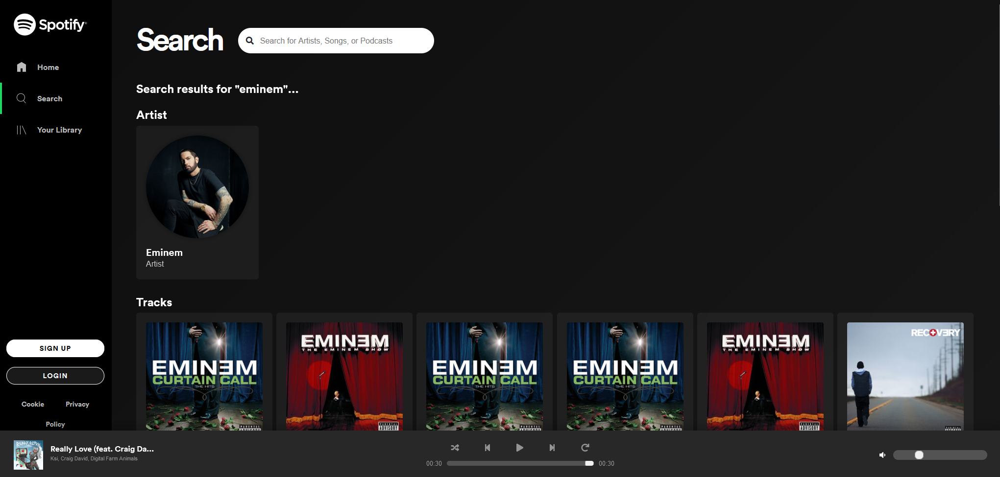
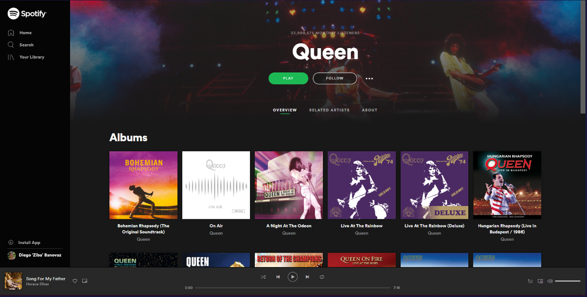
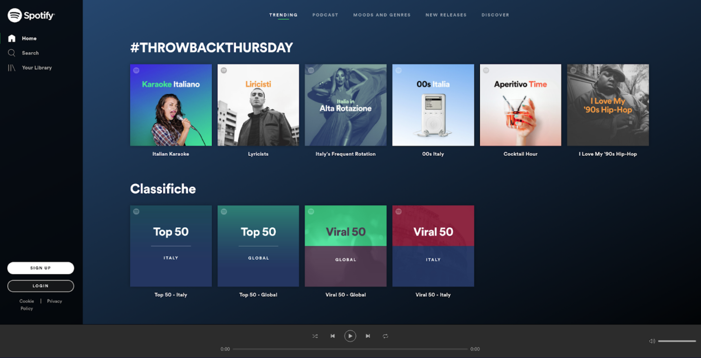
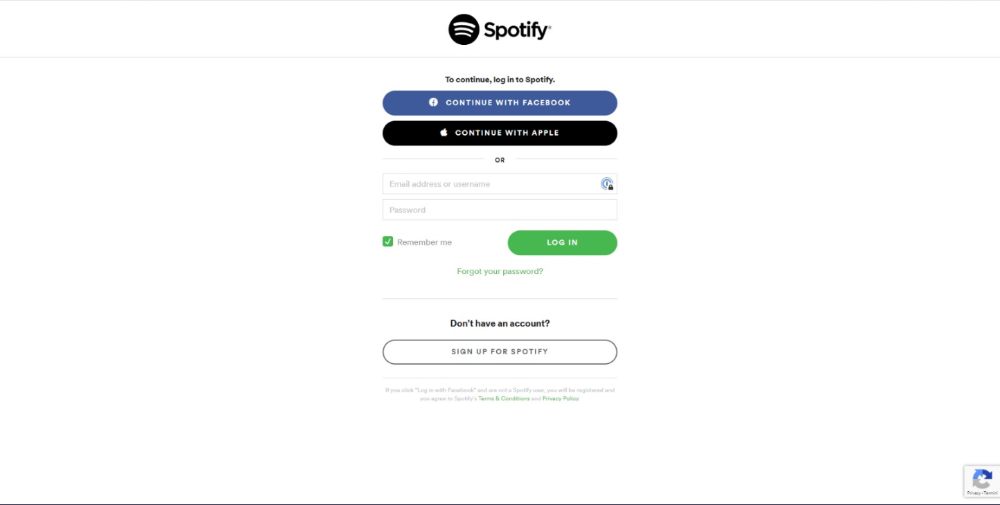

# The goal is to create a copy of the Spotify Interface.

- used the [Deezer API](https://developers.deezer.com) for music streaming.
- used Firebase to configure the Authentication and storing of the Users.
- Fully functioning audio player with the ability to search for artists and albums.

```
    The required pages are:
    - Login page
    - Home page
    - Artist page
    - Search page


---



---



---



---


```
